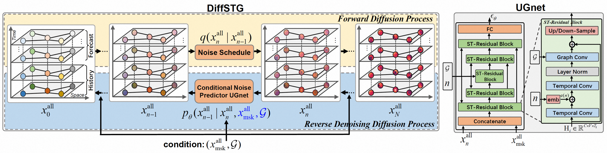

## DiffSTG: Probabilistic Spatio-Temporal Graph Forecasting  with Denoising Diffusion Models

### Model Architecture


### Run

1. requirements:
```shell
torch
easydict
nni
```

2. start training
```shell
python train.py
```

## Cite
If you find this helpful, please cite our paper:
```shell
@misc{wen2023diffstg,
      title={DiffSTG: Probabilistic Spatio-Temporal Graph Forecasting with Denoising Diffusion Models}, 
      author={Haomin Wen and Youfang Lin and Yutong Xia and Huaiyu Wan and Qingsong Wen and Roger Zimmermann and Yuxuan Liang},
      year={2023},
      eprint={2301.13629},
      archivePrefix={arXiv},
      primaryClass={cs.LG}
}
```